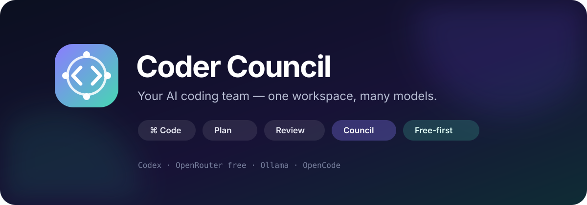
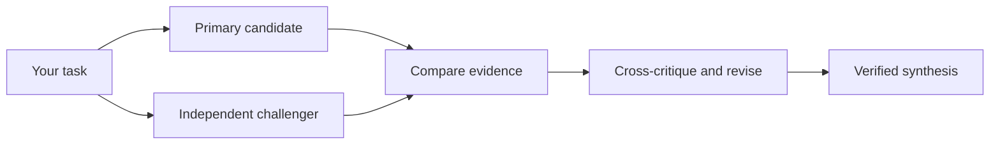

<div align="center">
  

  <h3>Your AI coding team.</h3>
  <p>Code with Codex. Bring in free and local models when you want a second opinion.</p>

  <p>
    <a href="https://github.com/preraktrivedi7/coder-council/actions/workflows/ci.yml"></a>
    <a href="https://github.com/preraktrivedi7/coder-council/releases/latest"></a>
    <a href="LICENSE"></a>
    
    
  </p>

  <p>
    <a href="https://preraktrivedi7.github.io/coder-council-site/">Website</a> ·
    <a href="https://preraktrivedi7.github.io/coder-council-site/#benefits">Why Council</a> ·
    <a href="https://preraktrivedi7.github.io/coder-council-site/compare/">Compare</a> ·
    <a href="https://preraktrivedi7.github.io/coder-council-site/get-started/">Get started</a>
  </p>
</div>

Coder Council is an open-source AI coding workspace for VS Code and the terminal.
Use it like a familiar coding assistant for chat, plans, edits, diffs, commands, and
approvals. When a decision deserves more scrutiny, switch to **Council** and let
independent models challenge and verify the answer before you act on it.

It works with your existing Codex login. Optional OpenRouter free routes and local
Ollama models expand the team without enabling paid per-token fallback.

## Start in 60 seconds

From the project you want to work on:

```bash
curl -fsSL https://raw.githubusercontent.com/preraktrivedi7/coder-council/main/install.sh | sh
```

Then open the project in VS Code, select the **Coder Council** icon, and choose
**Open coding workspace**.

The installer checks Node.js, downloads the source, verifies the VS Code extension,
installs it when the `code` launcher is available, initializes the current project,
and enables free/local model routes. It does not ask for or store provider keys.

Requirements: Node.js 20+, Git, and macOS or Linux for the one-line installer. The
full workspace also needs VS Code 1.95+ and the official Codex CLI. Missing tools
produce direct setup instructions instead of silent fallbacks.

Prefer to inspect the code first?

```bash
git clone https://github.com/preraktrivedi7/coder-council.git
cd coder-council
npm install
npm link
coder-council setup
```

On Windows, run those manual commands in PowerShell, then download the `.vsix`
from the [latest release](https://github.com/preraktrivedi7/coder-council/releases/latest)
and choose **Extensions: Install from VSIX...** in VS Code.

## One workspace, five modes

| Mode | Use it for | Access |
| --- | --- | --- |
| **Code** | Implementing, debugging, running commands, and editing files | Write with approvals |
| **Plan** | Exploring a codebase and designing a change before implementation | Read-only |
| **Ask** | Understanding code, architecture, errors, and tradeoffs | Read-only |
| **Review** | Finding bugs and regressions in the current working tree | Read-only |
| **Council** | Getting independent solutions, critique, and evidence-backed synthesis | Read-only orchestration |

The VS Code workspace includes:

- searchable Codex threads with resume support;
- streamed messages, tool activity, command output, and file changes;
- model and reasoning-effort controls;
- editor selection and bounded multi-file context;
- Markdown, syntax-highlighted copyable code, diffs, and approvals;
- stop controls, workspace trust, provider health, and guided setup.

## Use more free AI

Coder Council combines the inference paths already available to you. It never rotates
accounts, bypasses quotas, or silently switches to a paid model.

| Provider | What it contributes | Cost behavior |
| --- | --- | --- |
| **Codex CLI** | Primary coding, chat history, tools, diffs, and approvals | Uses your authenticated Codex access |
| **OpenRouter** | A changing pool of free cloud models | Free routes only; paid routes are rejected |
| **Ollama** | Private local challengers and reviewers | No per-token provider charge |
| **OpenCode** | Optional additional local/provider runtime | Uses its own authenticated configuration |

### OpenRouter free models

Export your key in the external shell that launches VS Code:

```bash
export OPENROUTER_API_KEY="..."
code .
```

If VS Code is already running, quit it fully first. Reloading a window does not add a
new environment variable to the existing extension host. Coder Council accepts only
`openrouter/free` or explicit `:free` model IDs while free-only mode is enabled.

### Local models with Ollama

```bash
ollama pull qwen2.5-coder:7b
coder-council config seat ollama enable qwen2.5-coder:7b
coder-council doctor
```

Use any Ollama coding model that fits your machine. When multiple optional seats are
healthy, automatic routing tries to keep challenger and arbiter roles on different
models. Unavailable seats are skipped; they do not trigger paid fallback.

See [provider setup](docs/AUTH.md) and [troubleshooting](docs/TROUBLESHOOTING.md).

## How Council mode works



1. The primary and challenger receive the same immutable task context in isolation.
2. Their answers stay hidden from each other until both initial candidates exist.
3. Comparison and critique surface agreements, conflicts, assumptions, and evidence.
4. Tests and reproducible checks outrank model votes in the final synthesis.

For code-changing workflows, exactly one implementation agent can hold the writer
lock. Reviewers and arbiters are read-only by default.

## Codex, without copying private state

Coder Council connects to the official
[Codex App Server](https://learn.chatgpt.com/docs/app-server) for authentication,
thread history, models, skills, approvals, and streamed coding events. It resumes
visible Codex threads through that supported interface; it does not read browser
cookies, copy OAuth tokens, or import private reasoning into `.council/`.

Provider authentication remains owned by each provider or runtime. Your project keeps
only redacted run evidence and the local configuration you choose to persist.

## Terminal workflows

```bash
coder-council ask "Where is authentication handled?"
coder-council council "Choose the safest migration strategy"
coder-council plan "Add passkey login"
coder-council review
coder-council build "Implement the approved plan"
coder-council stats
```

The shorter `council` command remains an alias. Project state lives in `.council/`.
Use `--json` for machine-readable output, `--dry-run` to inspect an operation without
provider calls or state mutation, and `--no-store` to avoid persisting a run.

## Safe by default

- Provider credentials stay in provider-owned tools or the process environment.
- Paid inference and telemetry are disabled.
- OpenRouter paid routes are rejected in free-only mode.
- Local services bind to `127.0.0.1`.
- Private chain-of-thought is neither requested nor persisted.
- VS Code requires workspace trust before running local tools.
- Automatic reset, clean, commit, and push are unsupported.
- Normal tests make no provider calls.

Read the [security policy](SECURITY.md), [security model](docs/SECURITY.md), and
[architecture](docs/ARCHITECTURE.md) for the exact trust boundaries.

## Build it with us

```bash
npm install
npm --prefix extensions/vscode install
npm test
npm run test:acceptance
npm run test:vscode
npm run check:vscode
npm run check:secrets
npm run check:public
npm run package:vscode
```

Live provider smoke tests are explicit opt-ins because they may consume configured
subscription or provider usage. Small, test-backed pull requests are welcome—start
with [CONTRIBUTING.md](CONTRIBUTING.md) and the [roadmap](docs/ROADMAP.md).

## FAQ

<details>
<summary><strong>Does Coder Council replace Codex?</strong></summary>

No. Codex is the primary coding runtime. Coder Council adds a VS Code workspace,
free/local model seats, and a structured second-opinion workflow around it.
</details>

<details>
<summary><strong>Is it free?</strong></summary>

The software is open source. Ollama runs locally, and OpenRouter is locked to free
routes. Codex and other provider access depend on the accounts or subscriptions you
already have. Unknown usage and cost values stay unknown rather than being estimated.
</details>

<details>
<summary><strong>Does it transfer my Codex history?</strong></summary>

It displays and resumes visible threads through Codex App Server. That gives the
extension continuity without copying Codex credentials, browser data, or private
thread databases into your repository.
</details>

<details>
<summary><strong>Is Kimi required?</strong></summary>

No. Kimi is optional. The baseline works with authenticated Codex alone and becomes
council-capable when another healthy free or local seat is available.
</details>

---

Apache-2.0 licensed. Built for developers who want faster coding without trusting a
single model blindly.
